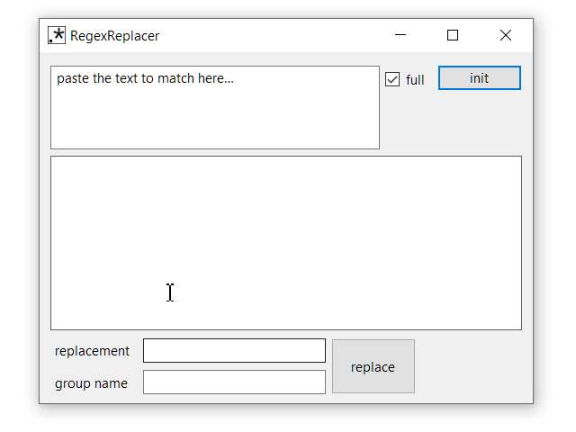

# RegexEscaper

## About

This program helps to create Regex.

Usage :

1. Paste the data source in the first field
2. Click init to create generic regex from source
3. Select the parts of the regex you want replaced by a different regex
4. Type the new value for the regex
5. _Optional_ Add a name for the new group
6. Click replace and restart at 3 until you have a regex you like

